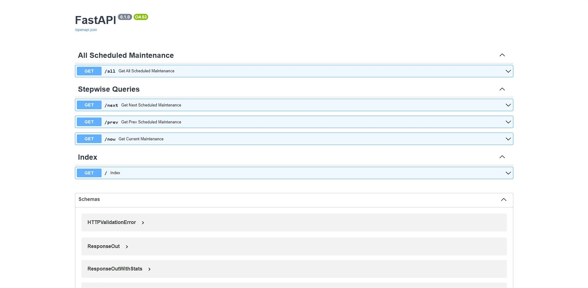

# Project Zohali (Saturn)

This is an API that consumes [Kenya Power's](https://twitter.com/KenyaPower_Care) Tweets to check for scheduled/planned
maintenance in Kenya.
Information extracted includes the Region, County, Area, Specific places, time as well as date of the planned incidents.
This API, consequently, makes the information publicly searchable, and analysable.

## Getting Started

### Configuration

First, supply a .env file that will hold all configuration details to the application's root directory. Ensure all
options and tokens are supplied as shown below (keys and tokens are generated from Twitter)

    ENCODING: = "utf-8"
    API_KEY:
    API_KEY_SECRET:
    BEARER_TOKEN:
    ACCESS_TOKEN:
    ACCESS_TOKEN_SECRET:
    SCREEN_NAME: = "KenyaPower_Care"
    TWEET_MODE: = "extended"
    TWEETS_COUNT: = 1500
    EXCLUDE_REPLIES: = True
    INCLUDE_RETWEETS: = False
    TIMEOUT: = 120
    POSTGRES_HOSTNAME:
    POSTGRES_USER:
    POSTGRES_PASSWORD:
    POSTGRES_PORT: = 5432
    POSTGRES_DATABASE_NAME:

Once all requisite configuration details are supplied accordingly, quickly run the project
using [docker](https://www.docker.com/) and
[docker-compose](https://docs.docker.com/compose/):

```bash
    $ docker-compose up -d
```

### Directory Structure:

    -/zohali/
        init.sh
        serve.py
        README.md
        docker-compose.yml
        Dockerfile
        requirements.txt
        alembic.ini
        nginx.conf
        .dockerignore
        .gitignore
        -/api/
            __ini__.py
            auth.py
            database.py
            models.py
            schemas.py
            tasks.py
            utils.py
        -/app/
            __init__.py
            authenticators.py
            exceptions.py
            patterns.py
            runner.py
            tweetListeners.py
            utils.py
            -/images/
            -/image_texts/
        -/confs/
            __init__.py
            configs.py
        -/migrations/
            ...
        -/data/
            db.sql
        -/tests/
            __init__.py
            test_authenticator.py
            test_tweet_listener.py
        -/postman collection/
            zohali.postman_collection.json

### Endpoints

All endpoints can be accessed through _**localhost:8000/docs**_ which is powered
by [Swagger UI](https://swagger.io/tools/swagger-ui/) as previewed below:


